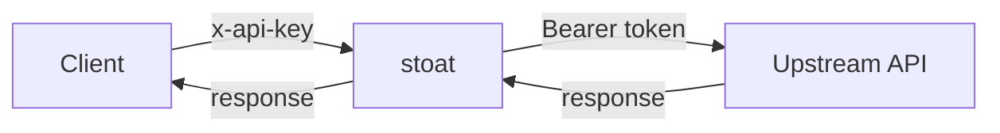

# stoat

**Streaming OAuth Transformer**

A config-driven local reverse proxy that manages OAuth token lifecycle and transforms requests so downstream clients can talk to OAuth-protected APIs using simple authentication.

## What It Does

stoat sits between a client and an upstream API. The client sends requests with a simple API key (or no auth). stoat replaces the auth headers with OAuth bearer tokens, applies configurable request mutations (headers, query params), and streams the response back. The client never knows OAuth is involved.



## Status

Pre-implementation. See the [implementation roadmap](docs/src/project/implementation.md) for what's planned.

## Usage

```sh
# One-time: complete the OAuth flow and store tokens
stoat login --config config.toml

# Start the proxy (prints port to stdout, logs to stderr)
stoat serve --config config.toml
# port=54321

# In another terminal, point your client at the proxy
SOME_API_BASE=http://127.0.0.1:54321 \
SOME_API_KEY=ignored \
some-client do-something
```

All provider-specific details (OAuth endpoints, client IDs, header rewrites) live in the user-supplied config file. The `stoat` binary itself contains no provider-specific code.

## Documentation

Full project documentation is in [`docs/src/project/`](docs/src/project/index.md), covering:

- [Architecture](docs/src/project/architecture.md) -- Proxy design, request flow
- [Configuration](docs/src/project/configuration.md) -- Config file schema, token storage
- [Implementation](docs/src/project/implementation.md) -- Phase checklist, roadmap
- [Decisions](docs/src/project/decisions.md) -- Resolved design decisions
- [Open Questions](docs/src/project/open-questions.md) -- Pending items

## License

Licensed under either of:

- Apache License, Version 2.0 ([LICENSE-APACHE](LICENSE-APACHE) or <http://www.apache.org/licenses/LICENSE-2.0>)
- MIT license ([LICENSE-MIT](LICENSE-MIT) or <http://opensource.org/licenses/MIT>)

at your option.
