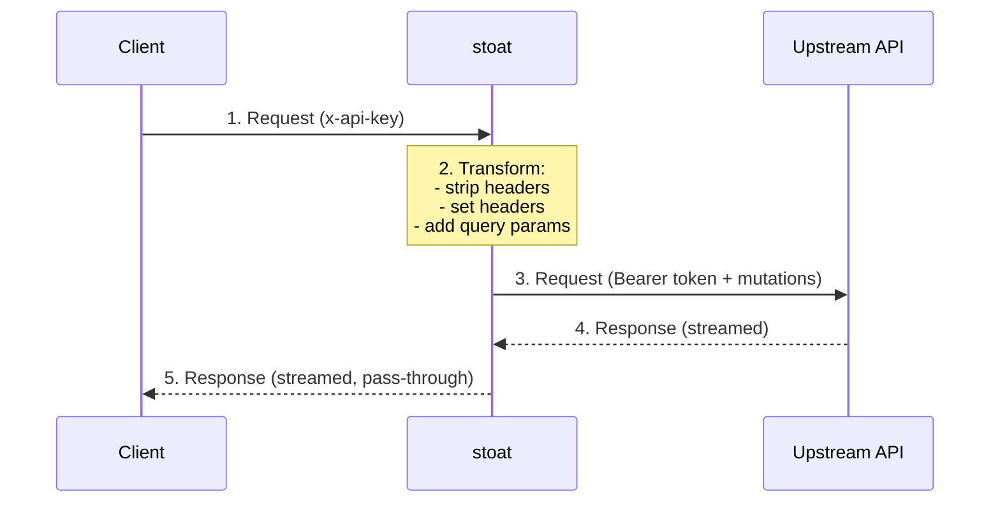

# Architecture

## Overview

stoat is a local reverse proxy.
It accepts HTTP requests from a downstream client, transforms them according to a config file, and forwards them to an upstream API.
The key transformation is authentication: the client authenticates with a simple mechanism (or not at all), and stoat replaces that with OAuth bearer tokens that it manages automatically.

## Request Flow



Per request:

1. Client sends a request to stoat's local listener.
2. stoat checks the OAuth token (refreshing if expired), then applies configured transformations:
   - Strips configured headers (e.g., `x-api-key`).
   - Sets configured headers (e.g., `Authorization: Bearer {access_token}`).
   - Appends configured query parameters.
3. The transformed request is forwarded to the upstream API with the original path and body unchanged.
4. The upstream response streams back through stoat.
5. The response is forwarded to the client unmodified.

## Streaming

stoat streams responses from the upstream API to the client as data arrives.
It does not buffer the full response before forwarding.
This is important for LLM APIs that use server-sent events (SSE) for streaming completions -- the client sees tokens as they are generated rather than waiting for the full response.

Request bodies are forwarded as-is without buffering or parsing.

## Token Lifecycle

stoat manages OAuth tokens automatically:

1. **Login** (`stoat login`): Performs an OAuth PKCE authorization code flow.
   Opens a browser for the user to authorize, receives the authorization code (via paste or local HTTP listener), exchanges it for access and refresh tokens, and stores them.
2. **Serve** (`stoat serve`): Before each proxied request, checks whether the access token is expired (or near expiry).
   If so, uses the refresh token to obtain a new access token from the configured token endpoint.
   Updated tokens are written back to the token file.

## Sans-IO Design

The project follows sans-IO design principles to maximize testability.
Core logic is separated from I/O operations into distinct crates.

### Core Crate (`stoat-core`)

Pure logic with **no I/O dependencies** -- no tokio, no async, no network, no filesystem.

Responsibilities:

- Config file types and deserialization
- PKCE code verifier and S256 challenge generation
- OAuth authorization URL construction
- Token types and expiry checking
- Request transformation (header stripping, header setting with template resolution, query parameter appending)

### I/O Crate (`stoat-io`)

Interprets effects from `stoat-core` against real I/O.

Responsibilities:

- axum HTTP server (local proxy listener)
- reqwest HTTP client (upstream API forwarding, token exchange/refresh)
- Browser launch for OAuth authorization flow
- Token file reading and writing
- Terminal I/O for paste-mode code receipt
- Local HTTP listener for OAuth callback receipt

### Binary Crate (`stoat`)

CLI entry point that wires `stoat-core` and `stoat-io` together.

## Workspace Layout

```text
stoat/
├── Cargo.toml                    # Workspace root
├── Cargo.lock
├── crates/
│   ├── stoat-core/               # Pure logic (sans-IO)
│   │   ├── Cargo.toml
│   │   └── src/
│   │       └── lib.rs
│   ├── stoat-io/                 # I/O layer (tokio, axum, reqwest)
│   │   ├── Cargo.toml
│   │   └── src/
│   │       └── lib.rs
│   └── stoat/                    # Main binary
│       ├── Cargo.toml
│       └── src/
│           └── main.rs
├── docs/
│   └── src/
│       ├── SUMMARY.md
│       └── project/
│           └── *.md
├── .cargo/
│   └── config.toml               # musl static linking flags
├── .config/
│   └── nextest.toml              # nextest CI profile
├── .github/
│   └── workflows/
│       └── ci.yml
├── rust-toolchain.toml
├── rustfmt.toml
├── deny.toml
├── codecov.yml
├── mise.toml
├── mise.lock
├── renovate.json5
├── .mergify.yml
├── .pre-commit-config.yaml
├── typos.toml
├── .markdownlint-cli2.yaml
├── .lychee.toml
├── AGENTS.md
├── README.md
├── LICENSE-MIT
└── LICENSE-APACHE
```

## Crate Descriptions

| Crate | Layer | Purpose |
| ----- | ----- | ------- |
| `stoat-core` | Core | Pure config, PKCE, token, and request transformation logic (no I/O) |
| `stoat-io` | Integration | HTTP server, HTTP client, browser launch, file I/O |
| `stoat` | Application | CLI binary, wires core + I/O together |

## Key Dependencies

| Crate | Layer | Purpose |
| ----- | ----- | ------- |
| `serde` / `toml` | Core | Config file deserialization |
| `sha2` / `base64` / `rand` | Core | PKCE code verifier and S256 challenge generation |
| `url` | Core | URL parsing and construction |
| `thiserror` | Core | Error types |
| `axum` + `tokio` | I/O | Local HTTP server |
| `reqwest` | I/O | Upstream HTTP client (streaming support) |
| `open` | I/O | Launch browser for OAuth flow |
| `tracing` | I/O | Structured logging (to stderr) |
| `clap` | Application | CLI argument parsing |
| `tracing-subscriber` | Application | Log output configuration |
